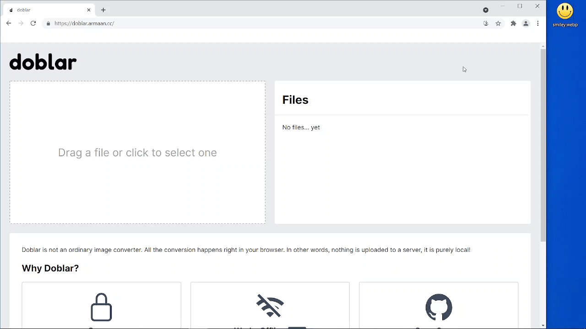

# [Doblar](https://doblar.armaan.cc)

Doblar is a fully local image converter that runs in your browser. Doblar is purely client side: nothing is uploaded to a server or anything like that. All conversions take place in your browser, which means your files never leave your computer.

**Try Doblar out at https://doblar.armaan.cc**

## 🎥 Demo

## ❓ What makes Doblar so special?
- **🔒 Secure:** Since your files never leave your device, you can use files safely without worrying about unauthorized access to them
- **📵 Works Offline:** Since Doblar is purely client side, we turned Doblar into a PWA, which means you can convert files with Doblar even if you are not connected to the internet! Try it out!

## Improvements that could be made
- [ ] **More formats**, instead of just images.
- [ ] **Nicer error handling** would also be great.
- [ ] **Better accessibility**. So far it is very, very bare and I am trying to make an effort to make my projects more accessible to everyone.
- [ ] More long term: using a smaller WASM build, as the current one is ~18MB, although the support for formats is wide with ImageMagick

## What does the name mean?
"doblar" means "to turn" in Spanish
